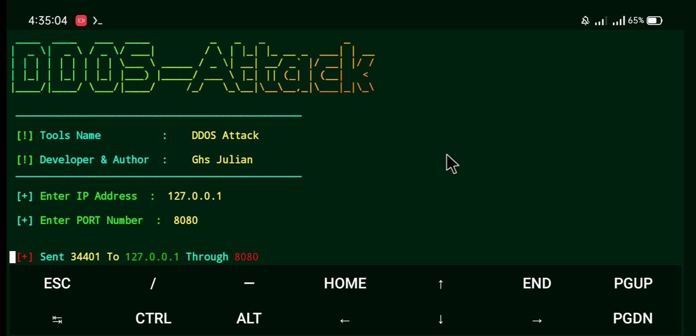
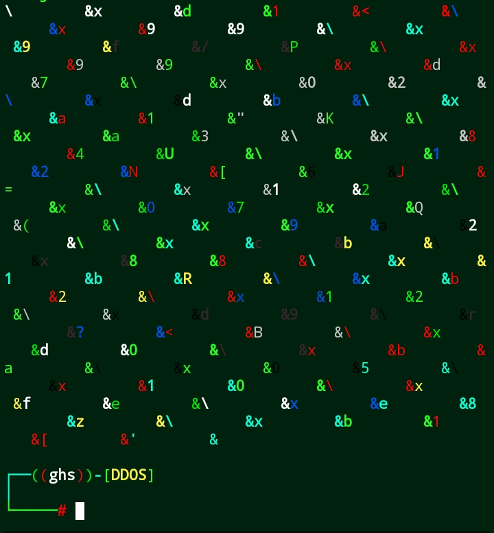
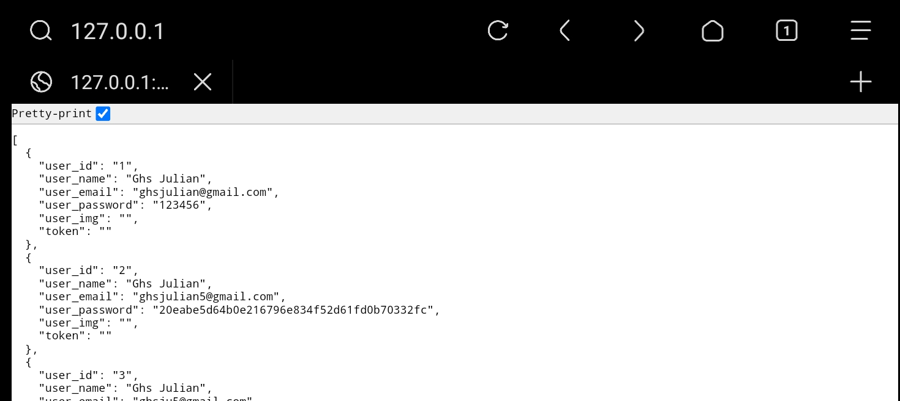

<h1> DDOS Attack </h1><br>
<h1>Developer : Ghs Julian</h1>
<br/><br/>


**This is simple DDOS Attack using python for educational purposes only , It won't do any illegal activity and if you use it illegal activity the code author won't take any responsibility**


<br><br>
<h1> Installation & Commands : </h1>
<br>

```bash
git clone https://github.com/Ghsjulian/DDOS-Attack.git
cd DDOS-Attack
python Attack.py
```

<br><br>

<h1>Demo & Screenshots : </h1>

<br><br>
<br><br>
<br><br>
